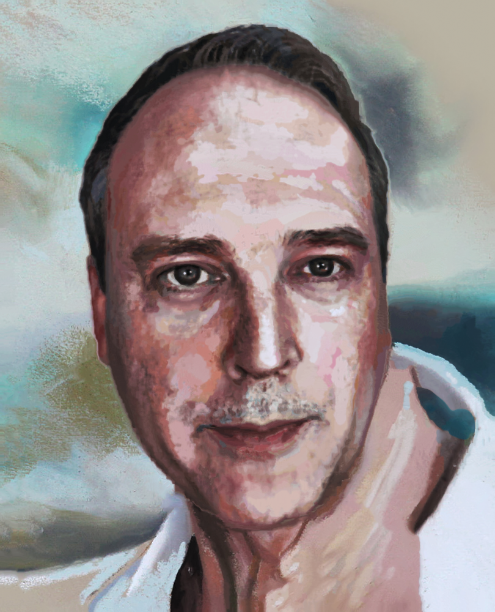
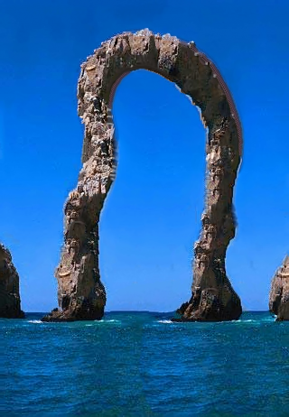

# Ezsynth - Ebsynth Python Library

Reworked version, courtesy of [FuouM](https://github.com/FuouM), with masking support and some visual bug fixes. Aims to be easy to use and maintain. 

**Examples:**
* To get started, see `test_redux.py` for an example of generating a full video.
* To generate image style transfer, see `test_imgsynth.py` for all examples from the original `Ebsynth`.

**Get started:**

1. git clone the repo
2. Place the `Ezsynth/ezsynth/utils/ebsynth.dll` file
3. Run script from your Python environment

**Note: This is not intended to be used as an installable module.**

Currently only tested on `Windows 10 - Python 3.11 - RTX3060`

> Perform things like style transfer, color transfer, inpainting, superimposition, video stylization and more!
This implementation makes use of advanced physics based edge detection and RAFT optical flow, which leads to more accurate results during synthesis.

> Ezsynth uses [Trentonom0r3/ebsynth](https://github.com/Trentonom0r3/ebsynth) - library version of Ebsynth.

## Building ebsynth.dll (Windows)

1. Git clone [Trentonom0r3/ebsynth](https://github.com/Trentonom0r3/ebsynth)
2. Copy `new_build-win64-cpu+cuda.bat` to `ebsynth`
3. Run the `.bat` inside `ebsynth/`
4. Copy `bin/ebsynth.dll` to `Ezsynth/ezsynth/utils/ebsynth.dll`

A pre-compiled `ebsynth.dll` is included in the repository. VirusTotal results: https://www.virustotal.com/gui/file/e3cfad210d445fcbfa6c7dcd2f9bdaaf36d550746c108c79a94d2d1ecce41369/detection

## Example outputs

| Face style | Stylit | Retarget |
|:-:|:-:|:-:|
|  |  |  |

https://github.com/user-attachments/assets/aa3cd191-4eb2-4dc0-8213-2c763f1b3316

## Notable things

**Changes:**
1. Flow is calculated on a frame by frame basis, with correct time orientation, instead of pre-computing only a forward-flow.
2. Padding is applied to Edge detection and Warping to remove border visual distortion.


**Observations:**
1. Edge detection models return NaN if input tensor has too many zeros(?).
2. Pre-masked inputs take twice as long to run Ebsynth

## API Overview

### ImageSynth
For image-to-image style transfer, via file paths: `test_imgsynth.py`
```python
ezsynner = ImageSynth(
    style_path="source_style.png",
    src_path="source_fullgi.png",
    tgt_path="target_fullgi.png",
    cfg=RunConfig(img_wgt=0.66),
)

result = ezsynner.run(
    guides=[
        load_guide(
            "source_dirdif.png",
            "target_dirdif.png",
            0.66,
        ),
        load_guide(
            "source_indirb.png",
            "target_indirb.png",
            0.66,
        ),
    ]
)

save_to_folder(output_folder, "stylit_out.png", result[0]) # Styled image
save_to_folder(output_folder, "stylit_err.png", result[1]) # Error image
```

### Ezsynth

video stylization. Via file paths: `test_redux.py`

```python
style_paths = [
    "style000.png",
    "style006.png"
]

ezrunner = Ezsynth(
    style_paths=style_paths,
    image_folder=image_folder,
    cfg=RunConfig(pre_mask=False, feather=5, return_masked_only=False),
    edge_method="PAGE",
    raft_flow_model_name="sintel",
    mask_folder=mask_folder,
    do_mask=True
)

only_mode = None
stylized_frames = ezrunner.run_sequences(only_mode)

save_seq(stylized_frames, "output")
```

Via Numpy ndarrays

```python
class EzsynthBase:
    def __init__(
        self,
        style_frs: list[np.ndarray],
        style_idxes: list[int],
        img_frs_seq: list[np.ndarray],
        cfg: RunConfig = RunConfig(),
        edge_method="Classic",
        raft_flow_model_name="sintel",
        do_mask=False,
        msk_frs_seq: list[np.ndarray] | None = None,
    ):
    pass
```

### RunConfig
#### Ebsynth gen params
* `uniformity (float)`: Uniformity weight for the style transfer.  Reasonable values are between `500-15000`. Defaults to `3500.0`.
     
* `patchsize (int)`: Size of the patches [NxN]. Must be an odd number `>= 3`.  Defaults to `7`.
     
* `pyramidlevels (int)`: Number of pyramid levels. Larger values useful for things like color transfer.  Defaults to `6`.
     
* `searchvoteiters (int)`: Number of search/vote iterations. Defaults to `12`.
* `patchmatchiters (int)`: Number of Patch-Match iterations. The larger, the longer it takes.  Defaults to `6`.
     
* `extrapass3x3 (bool)`: Perform additional polishing pass with 3x3 patches at the finest level.  Defaults to `True`.
        
#### Ebsynth guide weights params    
* `edg_wgt (float)`: Edge detect weights. Defaults to `1.0`.
* `img_wgt (float)`: Original image weights. Defaults to `6.0`.
* `pos_wgt (float)`: Flow position warping weights. Defaults to `2.0`.
* `wrp_wgt (float)`: Warped style image weight. Defaults to `0.5`.
    
#### Blending params
* `use_gpu (bool)`: Use GPU for Histogram Blending (Only affect Blend mode). Faster than CPU. Defaults to `False`.
     
* `use_lsqr (bool)`: Use LSQR (Least-squares solver) instead of LSMR (Iterative solver for least-squares) for Poisson blending step. LSQR often yield better results. May change to LSMR for speed (depends).  Defaults to `True`.
     
* `use_poisson_cupy (bool)`: Use Cupy GPU acceleration for Poisson blending step. Uses LSMR (overrides `use_lsqr`). May not yield better speed. Defaults to `False`.
     
* `poisson_maxiter (int | None)`: Max iteration to calculate Poisson Least-squares (only affect LSMR mode). Expect positive integers. Defaults to `None`.
     
* `only_mode (str)`: Skip blending, only run one pass per sequence. Valid values:
  * `MODE_FWD = "forward"` (Will only run forward mode if `sequence.mode` is blend)
  
  * `MODE_REV = "reverse"` (Will only run reverse mode if `sequence.mode` is blend)
  
  * Defaults to `MODE_NON = "none"`.
    
#### Masking params
* `do_mask (bool)`: Whether to apply mask. Defaults to `False`.
 
* `pre_mask (bool)`: Whether to mask the inputs and styles before `RUN` or after. Pre-mask takes ~2x time to run per frame. Could be due to Ebsynth.dll implementation. Defaults to `False`.     
 
* `return_masked_only (bool)`: Whether to return the styled results without applying it back to the original image. Defaults to `False`.     
 
* `feather (int)`: Feather Gaussian radius to apply on the mask results. Only affect if `return_masked_only == False`. Expects integers. Defaults to `0`.

## Credits

jamriska - https://github.com/jamriska/ebsynth

```
@misc{Jamriska2018,
  author = {Jamriska, Ondrej},
  title = {Ebsynth: Fast Example-based Image Synthesis and Style Transfer},
  year = {2018},
  publisher = {GitHub},
  journal = {GitHub repository},
  howpublished = {\url{https://github.com/jamriska/ebsynth}},
}
```
```
Ondřej Jamriška, Šárka Sochorová, Ondřej Texler, Michal Lukáč, Jakub Fišer, Jingwan Lu, Eli Shechtman, and Daniel Sýkora. 2019. Stylizing Video by Example. ACM Trans. Graph. 38, 4, Article 107 (July 2019), 11 pages. https://doi.org/10.1145/3306346.3323006
```

FuouM - https://github.com/FuouM
pravdomil - https://github.com/pravdomil
xy-gao - https://github.com/xy-gao

